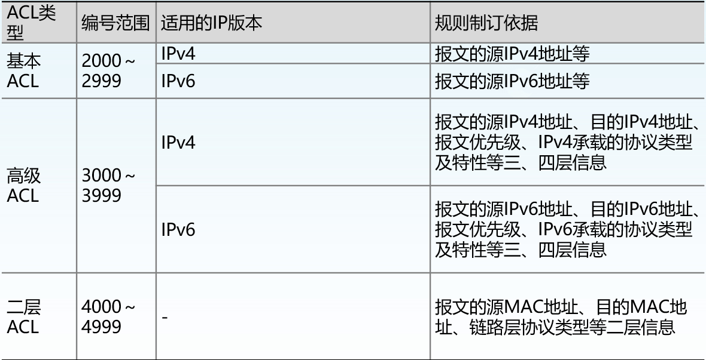

# 第零章
## 常用视图
    用户视图<Huawei>  
    系统视图[Huawei]  
    接口视图


## 常用指令
```
<Huawei>undo terminal monitor    //关闭日志，以获取更好的显示
<Huawei>sys                      //进入系统视图
[Huawei]sysname xxx              //更改设备名
```


# 第一章：使用telnet方式登录交换机
## 1. IPv4环境
### 交换机操作
```
<sw>sys  
[sw]int vlanif 1  
[sw-vlanif1]ip add x.x.x.x xx  

//配置用户远程登录（模式）口令和权限
//使能服务器功能
<sw>sys
[sw]telnet server enable
[sw]telnet server-source-i vlanif 1

// 配置VTY用户界面的支持协议类型
[sw]user-int vty 0 4
[sw-ui-vty0-4]protocol inbound telnet      //指定VTY用户界面所支持的协议为telnet

// 配置VTY用户界面的认证方式为password
[sw-ui-vty0-4]authentication-mode password
[sw-ui-vty0-4]set authentication password simple xxx      
[sw-ui-vty0-4]user privilege level 15
```
### PC机操作
```    
// ensp中PC机不支持Telnet功能，因此使用交换机代替PC机进行实验
<pc>sys
[pc]int vlanif 1
[pc-vlanif1]ip add x.x.x.x xx  //与交换机配置在同一网段

// 在用户视图下执行telnet命令
<pc>telnet x.x.x.x
// 按照提示输入密码
```

## 2. IPv6
### 交换机操作
```
<sw>sys
[sw]ipv6                        //全局使能ipv6
[sw]int Vlanif 1
[sw-Vlanif1]ipv6 enable         //vlanif视图下使能ipv6
[sw-Vlanif1]ipv6 add ...
[sw-Vlanif1]quit
[sw]telnet server enable
[sw]telnet server-source-i vlanif 1
[sw]user-int vty 0 4
[sw-ui-vty0-4]protocol inbound telnet
[sw-ui-vty0-4]authentication-mode password 
[sw-ui-vty0-4]set authentication password simple ...
[sw-ui-vty0-4]user privilege level 15
```
### PC机操作
```
<pc>sys
[pc]ipv6
[pc]int Vlanif 1
[pc-Vlanif1]ipv6 enable 
[pc-Vlanif1]ipv6 address ...    //与交换机同一网段
[pc-Vlanif1]return
<pc>telnet ipv6 ...             //telnet命令后必须标明使用ipv6 
```


# 第二章：交换机端口配置
## 端口类型配置命令
```
[sw-GigabitEthernet0/0/1] mdi { normal | cross | auto }
// normal ： MDI-X 端口
// cross ： MDI 端口
// automdix ： 自适应
```

## 流量控制配置命令
```
[sw-GigabitEthernet0/0/1] flow-control
[sw-GigabitEthernet0/0/1] undo flow-control
// 华为系列交换机所有端口在缺省情况下都禁用了流量控制功能
```

## 端口聚合配置
```
// 创建（删除）聚合接口（逻辑），并进入聚合接口视图
[sw]int eth-trunk X   //X：聚合端口号，取值范围为0-63）
[sw]undo int eth-trunk X

// 配置手工负载分担模式
[sw-Eth-TrunkX]mode manual load-balance 

// 在聚合接口视图下,向聚合接口中加入（删除）成员接口
[sw-Eth-TrunkX]trunkport int-type interface-number1 [ to interface-number2 ]     // int-type：端口类型
    eg.[sw-Eth-TrunkX]trunkport g 0/0/1 to 0/0/5
[sw-Eth-TrunkX]undo trunkport int-type interface-number1 [ to interface-number2 ]
    eg.[sw-Eth-TrunkX]undo trunkport g 0/0/1 to 0/0/5

// 在以太网接口视图下将接口0/0/X加入（退出）聚合组
[sw-GigabitEthernet0/0/X]eth-trunk trunk-id 
[sw-GigabitEthernet0/0/X]undo eth-trunk trunk-id 

// 查看Eth-Trunk的成员接口信息
<sw>display trunkmembership eth-trunk 
查看Eth-Trunk接口的配置信息
<sw>display eth-trunk trunk-id [ interface interface-type interface-number | verbose ]  // verbose查看Eth-Trunk接口的详细配置信息
```


# 第三章：生成树协议
STP/RSTP需要通过BPDU报文交互来完成生成树计算。因此，需先在要参与生成树计算的接口下使用bpdu enable命令使能上送BPDU报文到CPU处理的功能
```
[sw-GigabitEthernet0/0/X]bpdu enable
```

## 启动/关闭生成树协议
```
// 全局
[sw]stp  enable
[sw]undo stp  enable 或 stp disable

// 接口
[sw-GigabitEthernet0/0/X]stp enable
[sw-GigabitEthernet0/0/X]undo stp enable
``` 

## 设定网桥优先级
如果网络中的所有交换机都在缺省配置下，根据BPDU比较原则，MAC地址最小的交换机被选为根桥，但是该交换机未必是理想的根桥，可以通过命令配置Bridge Priority将合适的交换机推举为根桥
```
[sw]stp priority bridge-priority
//bridge-priority：用来标识所设定的bridge 优先级，该值是不连续的，范围为0～61440，步长为4096。缺省情况下，交换机的优先级为32768。

[sw]undo stp priority    // 恢复为缺省值
```

## 设定端口优先级
```
[sw-GigabitEthernet0/0/1] stp port priority port-priority
//port-priority：用来标识所设定的优先级，该值是不连续的，范围为0～240，步长为16。缺省情况下，端口优先级为128。
[sw-GigabitEthernet0/0/1] undo stp port priority
```

## 设定端口开销
```
[sw-GigabitEthernet0/0/1] stp cost X 
// X：用来标识所设定的路径开销值，范围1～200000。缺省情况下，网桥根据与端口相连的链路速率而直接得到端口的路径开销。
[sw-GigabitEthernet1/0/1] undo stp cost
```

## 显示生成树协议信息
```
[任意视图] display stp   [ brief ]
```


# 第四章：交换机VLAN配置
## VLAN中链路类型：
### 1. 接入链路（Access Link）
用于连接用户主机和交换机的链路。通常情况下，主机并不需要知道自己属于哪个VLAN，主机硬件通常也不能识别带有VLAN标记的帧。因此，主机发送和接收的帧都是untagged帧。
### 2. 干道链路（Trunk Link）
用于交换机间的互连或交换机与路由器之间的连接。干道链路可以承载多个不同VLAN数据，数据帧在干道链路传输时，干道链路的两端设备需要能够识别数据帧属于哪个VLAN，所以在干道链路上传输的帧都是Tagged帧。

## VLAN中端口类型
### 1. 接入端口（Access Port）
一般用于接入链路，且发送/接收不带有VLAN标签的帧（untagged frames）。如果Access接口配置了缺省VLAN，则在该报文（指接收的报文）上加上Tag标记，并将Tag中的VID字段的值设置为接口所属的缺省VLAN编号，此时接入链路上允许与缺省VLAN Tag匹配的以太网帧（不带标签）通过。
只能属于一个VLAN
主要用来连接用户主机
### 2. 骨干端口（Trunk Port）
一般用于骨干链路，发送/接收带有VLAN标签的帧（tagged frames），但VLAN ID与Trunk Link的缺省VLAN ID相同的帧除外。
允许多个VLAN的帧通过
主要用来连接其它交换机设备
### 3. 混合端口（Hybrid Port）
既可以用于接入链路也可以用于干道链路，既可以发送/接收带有VLAN标签的帧，也可以发送/接收不带有VLAN标签的帧
允许多个VLAN的帧通过，并可以配置在出接口方向是否将VLAN帧的Tag剥掉
既可以用来连接用户主机也可以用来连接其它交换机设备

## 创建/删除VLAN
```
[sw]vlan X  //X是vlan的id,取值范围为1～4094
[sw]undo vlan X
```

## 配置二层以太网端口类型
```
[sw-GigabitEthernet0/0/X]port link-type { access | trunk | hybrid }
//恢复为缺省值命令：
[sw-GigabitEthernet0/0/X]undo port link-type
```

## 关联VLAN和端口(Access端口)
### 1. vlan视图下
```
[sw-vlanX]port int-type { interface-number1 [ to interface-number2 ] } 
[sw-vlanX]undo port int-type { interface-number1 [ to interface-number2 ] } 
    eg.[sw-vlan2] port g 0/0/1 to g 0/0/12
```
### 2. 端口组视图下
```
[sw]port-group 1to12
[sw-port-group-1to12]group-member g 0/0/1 to g 0/0/12
[sw-port-group-1to12]port link-type access
[sw-port-group-1to12]port default vlan 2 
[sw-port-group-1to12]undo port default vlan 2 
```

## 关联端口和VLAN（Trunk端口）
```
// 允许某些VLAN的帧能通过当前Trunk端口：
[sw-GigabitEthernet0/0/X]port trunk allow-pass vlan { vlan_id_list | all }
// vlan_id_list: vlan_id1 [to vlan_id2]
// 将当前Trunk端口从某些VLAN中删除：
[sw-GigabitEthernet0/0/X]undo port trunk allow-pass vlan { vlan_id_list | all }
```


# 第五章：telnet方式登录路由器
## 1. IPv4环境
### 路由器配置
```
// 设置AAA认证
[sw]user-interface vty 0 4
[sw-ui-vty0-4]authentication-mode aaa       // 设置用户认证方式为AAA认证
[sw-ui-vty0-4]quit
[sw]aaa         // 进入aaa视图
//创建本地用户，并配置对应的登录密码
[sw-aaa]local-user user-name password { cipher | irreversible-cipher } xxx      //xxx是用户密码
    eg.[sw-aaa]local-user yf password cipher 123456
//配置本地用户的接入类型为Telnet用户
[Huawei-aaa]local-user user-name service-type telnet
[Huawei-aaa]local-user hui privilege level 15

//进入接口视图配置IPv4地址
```
### PC机操作
```    
// ensp中PC机不支持Telnet功能，因此使用交换机代替PC机进行实验
<pc>sys
[pc]int vlanif 1
[pc-vlanif1]ip add x.x.x.x xx  //与直连路由器的接口配置在同一网段

// 在用户视图下执行telnet命令
<pc>telnet x.x.x.x
// 按照提示输入用户名、密码
```

## 2. IPv6环境


# 第六章：配置路由表
## 1. 静态路由
### IPv4环境
```
<RT>sys
[RT]ip route-static x.x.x.x xx x.x.x.x（目的地址、掩码长度/掩码、下一跳地址）
！！！缺省路由/默认路由
[RT]ip route-static 0.0.0.0 0 x.x.x.x
```
### IPv6环境
```
<RT>sys
[RT]ipv6
[RT]ipv6 route-static ...
```

## 2. RIP
在路由器中开启RIP协议后还需要将特定接口/网段与RIP关联  
即将我们希望使用RIP的接口及其所在网段加入本机的RIP协议工作网段中  
**一个接口仅能和一个RIP进程关联**
### 配置RIP版本
用户可以在RIP视图下配置RIP版本，也可在接口上配置RIP版本：  
当全局和接口都没有进行RIP版本配置时，接口发送RIP-1广播报文，可以接收RIP-1广播/单播报文、RIP-2广播/组播/单播报文。  
如果接口上配置了RIP版本，以接口配置的为准；如果接口没有进行RIP版本配置，接口运行的RIP版本将以全局配置的版本为准
```
// 指定接口的版本为RIP-1  
[sw-Serial1/0] rip version 1  
// 指定接口的版本为RIP-2  
[sw-Serial1/0] rip version 2 [broadcast | multicast]  
// 配置全局RIP版本  
[sw-RIP-1] version { 1 | 2 }
```
### 启动/关闭水平分割
```
[sw-Serial1/0/0]rip split-horizon
[sw-Serial1/0/0]undo rip split-horizon
```
### IPv4环境（RIP）
```
<RT>sys
[RT]rip
[RT-rip-1]net x.x.x.x   //本机接口所在网段（不是本机接口IP地址）
```
### IPv6环境（RIPng）
与IPv4环境区别在于，IPv6环境只能通过让接口使能RIPng将接口与本机RIPng进程关联，无法直接指定网段
```
<RT>sys
[RT]ipv6           //全局使能ipv6
[RT]ripng 1        //启动RIPng进程
[RT]int g 0/0/0
[RT-g0/0/0]ipv6 enable      //接口使能ipv6
[RT-g0/0/0]ipv6 add ...
[RT-g0/0/0]ripng 1 enable   //接口与RIPng 1 进程关联
```

## 3. OSPF
### 创建/关闭OSPF进程
process-id 为进程号，缺省值为1。路由器支持OSPF多进程，可以根据业务类型划分不同的进程。进程号是本地概念，不影响与其它路由器之间的报文交换。因此，不同的路由器之间，即使进程号不同也可以进行报文交换。 
```
[RT]ospf process-id
[RT]undo ospf process-id
```
### 配置路由器id
（1）**<font color="red">不论IPv4还是IPv6</font>**，路由器的ID号都是一个32比特的无符号整数，为点分十进制格式，它是路由器所在自治系统中的唯一标识。  
（2）如果路由器所有的接口都没有配置IP地址，那么用户必须配置路由器ID号，否则OSPF无法运行。
```
[RT]router-id X     //X为路由器的ID号。
```
缺省情况下，路由器系统会从当前接口的IP地址中自动选取一个最大值作为Router ID。手动配置Router ID时，必须保证自治系统中任意两台Router ID都不相同。通常的做法是将Router ID配置为与该设备某个接口的IP地址一致，这样便可以保证它的唯一性。
### 删除/创建区域
```
[sw-ospf-1]area 0
[sw-ospf-1]undo area 0          //区域默认是32位表示
```
### 在区域中指定网段
```
[sw-ospf-1-area-0.0.0.0]net x.x.x.x y.y.y.y(前者是网段地址/接口地址、后者是子网掩码反码)
[sw-ospf-1]undo area 0
```
### 在接口上使能OSPF<font color="red">（但是必须先创建OSPF进程和区域）</font>
```
[RT-g0/0/0]ospf enable process-id area area-id
    eg.[RT-g0/0/0]ospf enable 1 area 0
```
### IPv4环境（OSPF）
```
//在端口视图下加入OSPF
<RT>sys
[RT]ospf 1 route-id 1.1.1.1
[RT]area 0
[sw-ospf-1-area-0.0.0.0]quit
[RT]int g 0/0/0
[RT-GigabitEthernet0/0/0]ospf enable 1 area 0

//在area视图下加入OSPF
<RT>sys
[RT]ospf 1 route-id 1.1.1.1
[RT]area 0
[RT-ospf-1-area-0.0.0.0]net x.x.x.x y.y.y.y(前者是网段地址/接口地址、后者是子网掩码反码)
```
### IPv6环境（OSPFv3）
```
<RT>sys
[RT]ospfv3 1
[RT]route-if 1.1.1.1
[RT]area 0
[sw-ospf-1-area-0.0.0.0]quit
[RT]int g 0/0/0
[RT-GigabitEthernet0/0/0]ospfv3 1 area 0
```
## 4. 路由引入
在缺省情况下，各路由协议不引入其它协议的路由。可以引入其他进程或其他协议学到的路由信息，从而丰富路由表项。
```
[RT]ripng 1
[RT-ripng-1]import-route {direct | ospfv3 | static}
[RT]ospfv3 1
[RT-ospfv3-1]import-route {direct | ripng | static}
```


# 第七章：IPv6基础
## 1. 手动配置IPv6地址
```
<RT>sys
[RT]ipv6           //全局使能ipv6
[RT]int g 0/0/0
[RT-g0/0/0]ipv6 enable      //接口使能ipv6
[RT-g0/0/0]ipv6 add ...
```

## 2. 有状态自动配置（DHCP）
```
<RT>sys
[RT]ipv6 
[RT]dhcp enable	            //全局使能DHCP
[RT]dhcpv6 pool pool1       //建立地址池
[RT-dhcpv6-pool-pool1]address prefix FC00:2::/64        //配置地址池网段
[RT-dhcpv6-pool-pool1]excluded-address FC00:2::1        //从地址池中将固定分配给路由器接口IP地址去除
[RT-dhcpv6-pool-pool1]quit
[RT]int GigabitEthernet 0/0/9
[RT-GigabitEthernet0/0/9]ipv6 enable 
[RT-GigabitEthernet0/0/9]ipv6 address FC00:2::1 64
[RT-GigabitEthernet0/0/9]dhcpv6 server pool1            //将接口与地址池绑定
[RT-GigabitEthernet0/0/9]undo ipv6 nd ra halt
[RT-GigabitEthernet0/0/9]ipv6 nd autoconfig managed-address-flag  //此命令用来设置RA报文中的有状态自动配置地址的标志位, 如果设置了该标志位，则PC可以通过DHCPv6有状态自动分配方式获得IPv6地址。
```

## 3. 无状态自动配置（SLAAC）
```
<RT>sys
[R1]ipv6 
[R1]int GigabitEthernet 0/0/9
[R1-GigabitEthernet0/0/9]ipv6 enable 
[R1-GigabitEthernet0/0/9]ipv6 addres FC00:1::1 64
[R1-GigabitEthernet0/0/9]undo ipv6 nd ra halt       // 此命令用于激活接口发布RA报文的功能
[R1-GigabitEthernet0/0/9]quit
```


# 第八章：ACL配置和NAT配置
## ACL
ACl可以在路由器接口的输入(inbound)和输出(outbound)两个方向上对IP包进行过滤



### IPv4环境下ACL配置
```
//创建ACL
[RT]acl acl-number [ match-order { config | auto } ] 
//config：匹配规则时按用户的配置顺序。 
//auto：匹配规则时按“深度优先”的顺序。
//acl-number需要遵守ACL类型的需求，不同的类型对应指令以及过滤能力不同

//ACL规则配置
[RT-acl-basic-2000]rule [rule-id] {permit | deny} [source sour-addr sour-wildcard | any] [time-range time-name]
//sour-wildcard：源地址掩码反码
//基本ACL只允许对源地址进行过滤，不允许对目的地址过滤

[RT-acl-adv-3000]rule [rule-id] {permit | deny} protocol [source sour-addr sour-wildcard | any] [ destination dest-addr dest-wildcard | any] [ source-port operator port1 [ port2 ] ] [ destination-port operator port1 [ port2 ] ] [ icmp-type { icmp-message | icmp-type icmp-code} ] [ time-range time-name ]
//protocol : ip, ospf, igmp, gre, icmp, tcp, udp, etc. 
//高级ACL允许同时对源地址、目的地址、协议以及端口进行过滤

//在接口上应用ACL规则
[RT-Serial1/0/0]traffic-filter {inbound | outbound} acl {acl-number | name acl-name}
//inbound和outbound一定要区分清楚

//显示ACL的配置及运行情况
[任意视图]dis acl {all | acl-number}
//显示设备上所有基于ACL进行报文过滤的应用信息
[任意视图]dis traffic-filter applied-record
//显示指定接口上基于ACL进行报文过滤的流量统计信息
[任意视图]dis traffic-filter statistics int interface-type interface-number {inbound | outbound}
```

### IPv6环境下ACL配置
```
[RT]acl ipv6 3000
[...]rule deny ipv6 source fc00:0::1 128 destination fc00:2::1 128
[...]quit
[RT]int g 0/0/0
[...]traffic-filter inbound ipv6 acl 3000
//IPV6环境下不使用掩码的反码，而是直接使用掩码/掩码长度
```

## NAT
### IPv4环境下配置NAT
NAT有两种实现方式：  
    1. 定义地址池  
        当内部网络有数据包要发往外部网络时，首先根据该ACL判定是否是允许的数据包，  
        然后再根据定义的关联找到与之对应的地址池，最后再把源地址转换成这个地址池中的某一个地址  
    2. 直接将内网地址映射到NAT路由器的接口上  
        接口与ACL的关联又称EASY IP 特性，它是指在地址转换的过程中直接使用接口的IP地址作为转换后的源地址  
```
//定义地址池
[RT]nat address-group group-index start-address end-address
    eg.[RT]nat address-group 1 address 210.30.101.1 210.30.101.4
//定义地址池与ACL的关联
[RT-Serial1/0/0]nat outbound acl-number address-group group-index 
    eg.[RT]acl 2000 match-order auto
       [RT-acl-basic-2000]rule permit source 192.168.1.0 0.0.0.255
       [RT-acl-basic-2000]rule deny source any
       [RT]nat address-group 1 address 210.30.101.1 210.30.101.4
       [RT-Serial1/0/0]nat outbound 2000 address-group 1
    
//定义接口与ACL的关联
[RT-Serial1/0/0]nat outbound 2000
    eg.[RT]acl 2000 match-order auto
       [RT-acl-basic-2000]rule permit source 192.168.1.0 0.0.0.255
       [RT-acl-basic-2000]rule deny source any
       [RT-Serial1/0]nat outbound 2000
```

用户可将内部服务器的IP地址和端口号映射到NAT路由器的外部地址以及端口号上，从而实现由外部网络访问内部服务器的功能。
```
//建立地址池映射命令：
[RT-Serial1/0/0]nat server protocol {protocol-number | icmp | tcp | udp} global global-addr { global-port | any | domain | ftp | pop3 | smtp | telnet | www } inside local-addr { local-port | any | domain | ftp | pop3 | smtp | telnet | www }
    eg.[RT-Serial1/0/0]nat server protocol tcp global 210.30.103.22 8080 inside 192.168.1.4 www

//建立接口映射命令
[RT-Serial1/0/0]nat server protocol {protocol-number | icmp | tcp | udp} global current-int { global-port | any | domain | ftp | pop3 | smtp | telnet | www } inside local-addr { local-port | any | domain | ftp | pop3 | smtp | telnet | www }
!!!如果想借用接口地址作为转换后的外网地址，可以配置参数current-interface或者loopback
```

一般情况下，NAT只能对IP报文头的IP地址和TCP/UDP头部的端口信息进行转换。  
对于一些特殊协议，例如DNS、FTP等，它们报文的数据部分可能包含IP地址或端口信息，这些内容不能被NAT有效的转换，从而无法正确完成通信。  
使能ALG(Application Level Gateway)功能可以使NAT设备识别被封装在报文数据部分的IP地址或端口信息，并根据映射表项
进行替换，实现报文正常穿越NAT。
```
[RT]nat alg ftp enable
```  
      


